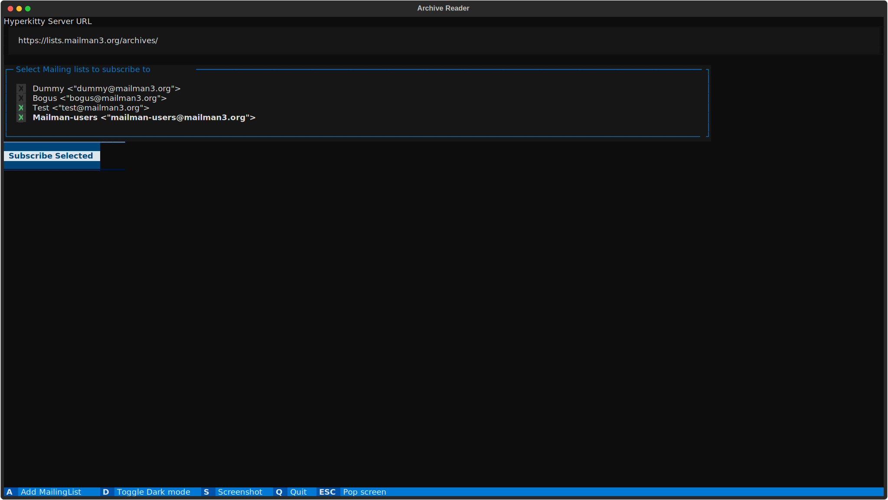
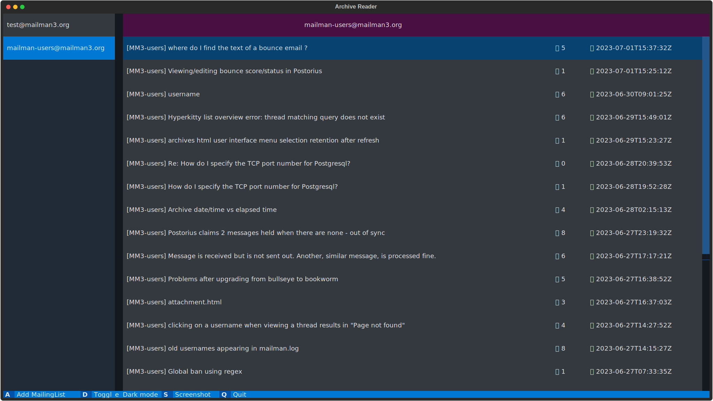
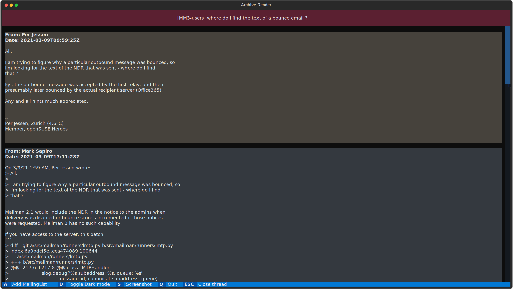

Archive Reader
==============

A terminal based archive reader for Hyperkitty, GNU Mailman's official archiver.

Screenshots
-----------








Hyperkitty Configuration
------------------------

In order to use this app, the Pagination on the Hyperkitty's API needs to be set correctly.


Running
-------
To run the app, first you need to create a virtualenv and then finally install dependencies.

```bash
$ python3 -m venv .venv
$ source .venv/bin/activate
$ pip install -e .
$ pdm run start
```